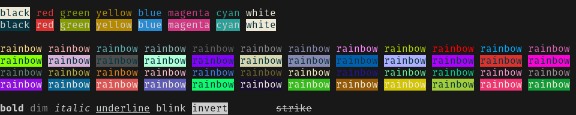

# Iridescent

<!-- markdownlint-disable -->
<div align="right">
<a href="https://crates.io/crates/iridescent">
    
</a>
<a href="https://docs.rs/iridescent/latest/iridescent/">
    
</a>
</div>
<br>
<div align="center">
    
</div>
<!-- markdownlint-enable -->

---

## Features

`iridescent` is a dependency-free library for styling terminal text easily.

It supports basic ANSI sequences, Xterm-256 colors, and RGB. You can operate
directly on `&str` and `String` types without needing to worry about
conversions.

It is important to note that not all terminals support all features. While
*most* modern terminals will support up to true RGB colors, certain text modes,
such as `blink`, are not reliable.

## Usage

```toml
[dependencies]
iridescent = { version = "0.2" }
```

The only requirement is that you import the `Styled` trait into the module you
plan on using library methods. Once you have declared it at the top of your
module, the methods will be available on all `&str` and `String` types.

Note that all `Styled` methods can be chained, as seen in the example above
where first we call the foreground method, followed by the bold method. These do
not have to be in any specific order.

### Using Basic Colors

```rust
use iridescent::{constants::GREEN, Styled};

fn main() {
    // Here we can use a built-in method called `.green()` to apply the color.
    // Every basic color has a helper method for the foreground, as this is
    // the most common thing to style.
    let s = "Hello".green().bold();

    // But we could manually do it this way, too. You'll need to import the
    // color codes from the constants file, of course.
    let s2 = "world".foreground(GREEN).bold();

    println!("{}, {}!", s, s2);
}
```

### Using 256-bit & RGB Colors

```rust
use iridescent::{Styled, Rgb};

fn main() {
    // We use .foreground() for a 256-bit color; in this case, 155 - or a lime green.
    let s = "Hello".foreground(155).underline();

    // Here we combine a 256-bit color with an RGB color. First, we set the foreground
    // to an RGB value of (4, 11, 214) - some variant of dark blue. Next, we set
    // the background to a value of 195 - a very light, almost white, blue. In 
    // addition, we apply some modes (underline and blink) to our text.
    //
    // As you can see, mixing and matching various sequence types is no problem!
    let s2 = "world"
        .foreground(&[4, 11, 214])
        .background(195)
        .blink();

    println!("{}, {}!", s, s2);
}
```

### Hexadecimal Colors

As of `v0.2`, you can now use hexadecimal color literals now, as well!

```rust
use iridescent::{Styled, constants::{RED, WHITE}};

fn main() {
    let hello = "Hello".foreground("#ff00ff").bold();
    let world = "world".foreground("#00ff00").background("#0000ff");
    println!("{hello}, {world}!");
}
```

See
**[here](https://docs.rs/iridescent/latest/iridescent/styled/trait.Styled.html)**
for all the methods available.

## Examples

If you have cloned the `iridescent` repository, you can run an example with the
command `cargo run --example <example_name>`. You can add features, if needed,
with --features <feature_name>.

<!-- markdownlint-disable -->
| Example | File                                    | Description                                                              | Features   |
|---------|-----------------------------------------|--------------------------------------------------------------------------|------------|
| rainbow | [colors.rs](/examples/ansi/colors.rs)   | Shows off all base colors in the terminal.                               |            |
| rgb     | [rainbow.rs](/examples/ansi/rainbow.rs) | Shows off both 8-bit and 24-bit depth randomized colors in the terminal. | `random`   |
| modes   | [modes.rs](/examples/ansi/modes.rs)     | Shows off the various text modes in the terminal.                        |            |
<!-- markdownlint-enable -->

## Feature Flags

<!-- markdownlint-disable -->
| Flag     | Default  | Description                                                                         | Dependencies |
|----------|----------|-------------------------------------------------------------------------------------|--------------|
| `random` | Disabled |Enables the use of `Color::random()` and `Color::random_rgb()`                       | `rand`       |
<!-- markdownlint-enable -->

## License

Iridescent is dual-licensed under either

- **[MIT License](/docs/LICENSE-MIT)**
- **[Apache License, Version 2.0](/docs/LICENSE-APACHE)**

at your option.
